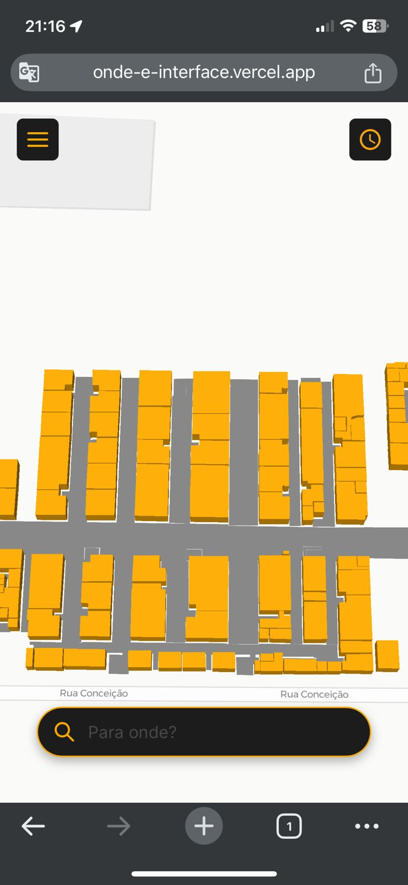
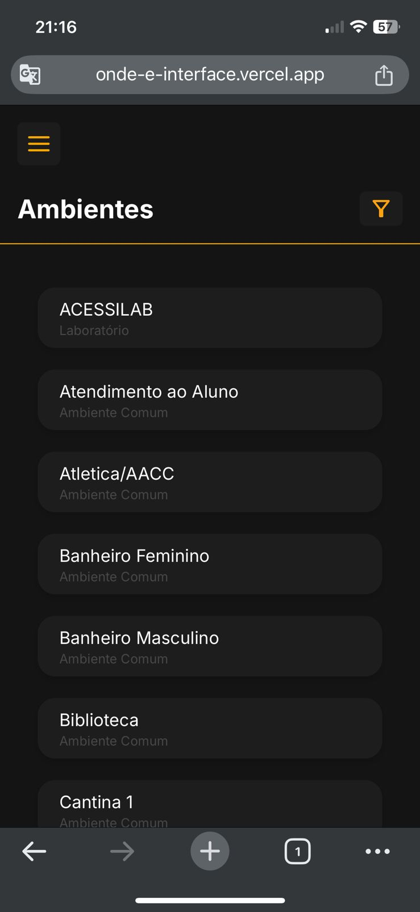

## 💻 Sobre o projeto

🔎 Onde é - Uma aplicação de localização e locomoção para ambientes internos.

Os usuários terão acesso ao website: 
- Navegação dentro de um mapa 3D do térreo da USCS Campus Conceição
- Geração de rotas dentro do mapa 3D
- Lista de ambientes encontrados no térreo

Projeto desenvolvido no 2º semestre de 2024 como parte do Trabalho de Conclusão de Curso (TCC) do curso de Ciência da Computação na Universidade Municipal de São Caetano do Sul (USCS).

## 🎨 Layout

O layout da aplicação está disponível no Figma:

<a href="https://www.figma.com/design/nir8gyMAED39S0mPGQTLLY/Onde%C3%89?node-id=0-1&t=7aLrdIN1HRZLLCVz-1">
  
</a>

<p align="center">
  

  
</p>

## 🛠 Tecnologias

As seguintes ferramentas foram usadas na construção do projeto:

- [React][reactjs]
- [NextJs][NextJs]
- [TypeScript][typescript]


## 🚀 Como executar o projeto

### Pré-requisitos

Antes de começar, você vai precisar ter instalado em sua máquina as seguintes ferramentas:
[Git][git], [Node.js][nodejs]. 
Além disto é bom ter um editor para trabalhar com o código como [VSCode][vscode].

O projeto também utiliza variáveis de ambientes (.env), para conseguir utilizar a base de banco de dados, será necessário subir as informações no [Back4App][back4app]. As informações das tabelas dos dados estão disponíveis para download no [Google Drive][gdrive]. Dentro deste link, também possui um passo a passo de como configurar o .env na aplicação e como inserir os dados no banco.

### 🧭 Rodando a aplicação

```bash
# Clone este repositório
$ git clone https://github.com/torressg/onde-e-interface

# Acesse a pasta do projeto no seu terminal/cmd
$ cd onde-e-interface

# Instale as dependências
$ npm i

# Execute a aplicação em modo de desenvolvimento - Recomendamos configurar o .env antes de rodar a aplicação
$ npm run dev

# A aplicação será aberta na porta:3000 - acesse http://localhost:3000
```


## 📝 Licença

Este projeto esta sobe a licença MIT.

[NextJs]: https://nextjs.org/
[nodejs]: https://nodejs.org/en
[vscode]: https://code.visualstudio.com/
[typescript]: https://www.typescriptlang.org/
[reactjs]: https://reactjs.org
[license]: https://opensource.org/licenses/MIT
[back4app]: https://www.back4app.com/
[git]: https://git-scm.com
[gdrive]: https://drive.google.com/drive/folders/1kQaJXp2ytjZYAL31rDRF3U_2frqtNjTX?usp=sharing
